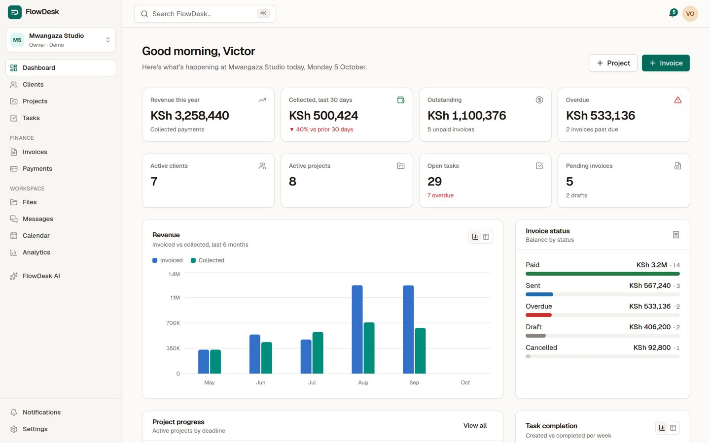
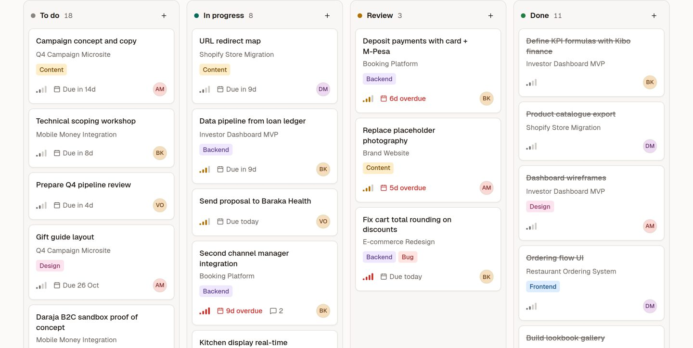
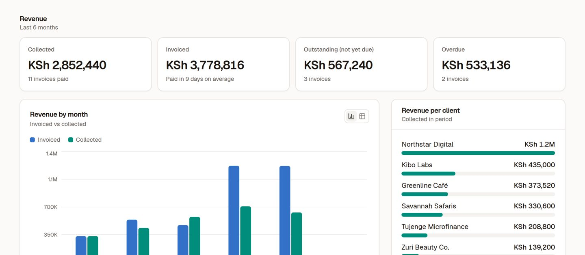
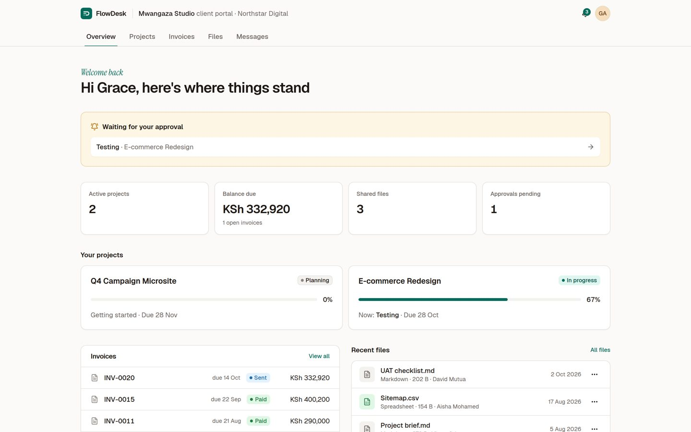
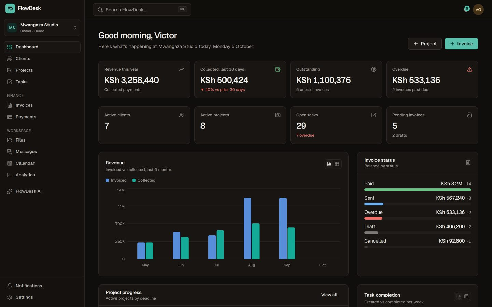
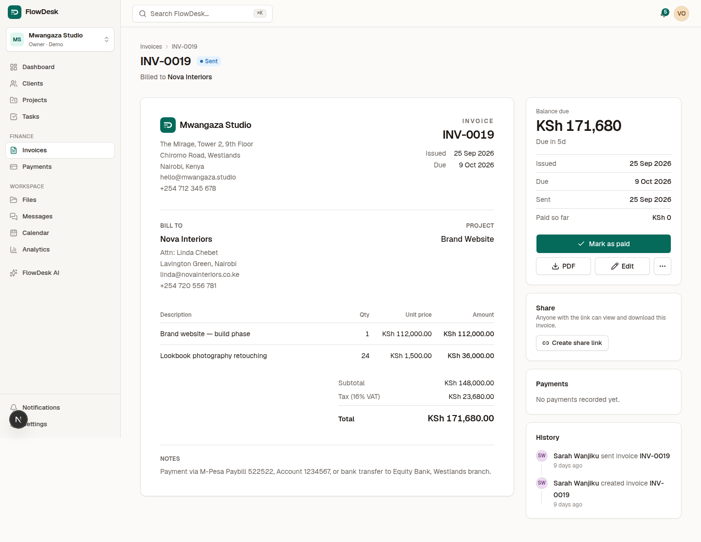
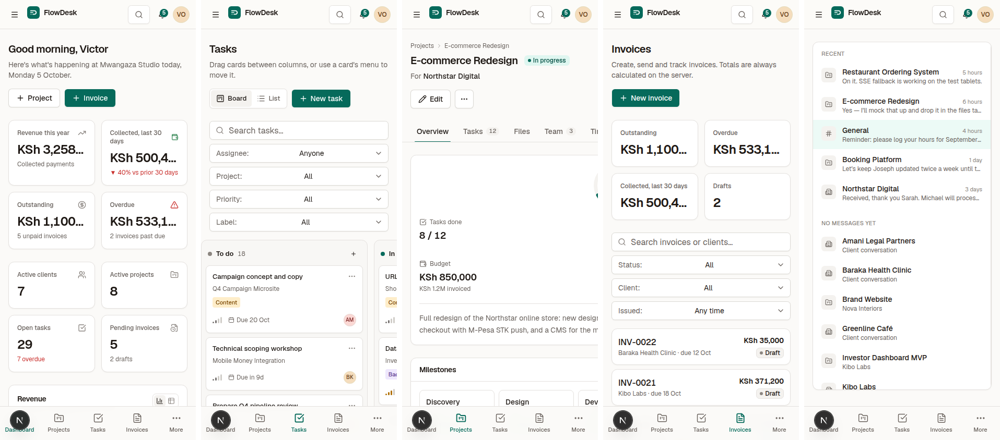

# FlowDesk

**Run your client work from one place.** FlowDesk is a full-stack SaaS for freelancers, agencies and small teams: a CRM, projects and tasks, invoicing with payment tracking, files, messaging, a calendar, analytics, an AI assistant and a client portal — in one workspace.

It's a portfolio project, built to production standards: real authentication, database-enforced authorization, server-side business rules, tests, and a design system made for the product.



> **Try it:** open `/demo` and sign in as the owner, a developer, or a client of a seeded Nairobi studio — no account needed.

---

## Features

| Area                | What works                                                                                                                                                                                                                                         |
| ------------------- | -------------------------------------------------------------------------------------------------------------------------------------------------------------------------------------------------------------------------------------------------- |
| **Dashboard**       | Revenue this year, cash collected (rolling 30 days vs the 30 before), outstanding and overdue balances, live counts, revenue and task-throughput charts, project progress, activity feed and an "upcoming" list. Every number is a database query. |
| **Clients (CRM)**   | Search, status/tag filters, sorting, pagination, create / edit / archive / delete (blocked when invoices exist), multiple contacts, notes, and a detail workspace with Overview, Projects, Invoices, Files, Messages and Activity tabs.            |
| **Projects**        | Status, priority, dates, budget, team, progress recalculated from tasks, milestones with **client approval**, and Overview, Tasks, Files, Team, Timeline and Messages tabs.                                                                        |
| **Tasks**           | Kanban with drag and drop (mouse, touch **and keyboard**, with screen-reader announcements), an accessible "Move to…" menu, a list view, filters, labels, comments, attachments and per-task activity.                                             |
| **Invoices**        | Editor with live totals, discounts (percent or fixed), VAT, notes, line items, atomic invoice numbering, send, mark paid, partial payments, cancel, duplicate, **PDF download** (react-pdf) and **public share links**.                            |
| **Payments**        | A ledger of payment records (M-Pesa, bank, card, cash, other) that drives each invoice's balance and PAID/OVERDUE status.                                                                                                                          |
| **Files**           | Supabase Storage with folders, links to clients/projects/tasks, explicit "share with client", type and size validation, authorised downloads.                                                                                                      |
| **Messages**        | Project threads, client threads and a team channel, with **internal notes** clients can never read.                                                                                                                                                |
| **Notifications**   | Assignment, comment, approval, file, invoice and deadline notifications, a popover, a full page, mark read / mark all read, and per-user preferences.                                                                                              |
| **Calendar**        | Month, week and agenda views combining meetings with task, project, milestone and invoice due dates.                                                                                                                                               |
| **Analytics**       | Revenue by month and by client, invoiced vs collected, days-to-pay, new clients, project health and delayed projects, task throughput and workload per person.                                                                                     |
| **Global search**   | ⌘K command palette across clients, projects, tasks, invoices and files, with keyboard navigation and quick "create" actions.                                                                                                                       |
| **FlowDesk AI**     | A chat assistant with tools that read workspace data, meeting-notes → summary / decisions / action items, project → task breakdown (review, then add to the board), invoice line drafting and one-click client briefings.                          |
| **Client portal**   | A separate experience for client users: their projects and timeline, approvals, tasks (read-only), invoices with PDF, shared files and uploads, and messages.                                                                                      |
| **Team & settings** | Invite by link, change roles, remove members, transfer ownership, workspace details (currency, timezone, invoice prefix, default VAT), profile, Clerk-hosted account security, theme and notification preferences.                                 |

Also: a public landing page, onboarding, multiple workspaces with a switcher, a designed dark mode, skeleton loading states, empty states, error boundaries, a 404 page and mobile-first navigation.

---

## Tech stack

- **Next.js 16** (App Router, Server Components, Server Actions, Route Handlers, Turbopack) · **React 19** · **TypeScript** (strict)
- **Tailwind CSS v4** with a custom token system · **Radix UI** primitives (via shadcn/ui, restyled) · **lucide** icons
- **Supabase** — PostgreSQL + Storage · **Drizzle ORM** (schema, migrations, typed queries) · **postgres.js**
- **Clerk** — authentication and account management
- **Vercel AI SDK v7** + **Vercel AI Gateway** — FlowDesk AI
- **react-hook-form** + **Zod** (shared client/server schemas) · **Recharts** · **dnd-kit** · **cmdk** · **@react-pdf/renderer** · **sonner**
- **Vitest** (unit + database integration) · **Playwright** (end-to-end)

---

## Architecture

```
src/
├── app/                    # Routes only — thin pages that compose features
│   ├── (app)/              # Internal app (staff): dashboard, clients, projects, tasks, invoices, …
│   ├── portal/             # Client portal (CLIENT role only)
│   ├── (auth)/             # Clerk sign-in / sign-up
│   ├── api/                # PDF, file download, AI chat stream, cron, health
│   ├── demo/ onboarding/ invite/ i/[token]/   # Public & onboarding flows
│   └── page.tsx            # Landing page
├── features/<domain>/      # queries.ts (reads), actions.ts (mutations), components/
├── server/
│   ├── auth/session.ts     # Clerk user → profile → active workspace + role
│   ├── actions/safe-action.ts  # The wrapper every mutation goes through
│   ├── db/                 # Drizzle schema + withRls()
│   ├── services/           # Activity, notifications, invoice state, project progress
│   ├── ai/                 # Model config + RLS-scoped assistant tools
│   └── seed/               # Demo dataset + seeding
├── components/             # Design system (ui/), shared building blocks, layout, charts
├── lib/                    # Pure logic: money, invoice math, permissions, validation, dates
drizzle/                    # SQL migrations (schema, RLS policies)
tests/                      # Vitest unit + RLS integration tests
e2e/                        # Playwright end-to-end tests
```

A monolith on purpose: one Next.js app and one Postgres database. Pages are Server Components that read data on the server; client components are limited to interactive pieces (forms, the board, dialogs, charts).

**Every mutation** is a Server Action created with `createAction()`, which:

1. resolves the signed-in user and active workspace from the Clerk session (IDs from the browser are never trusted),
2. checks the role permission (`lib/permissions.ts`),
3. validates input with the same Zod schema the form used,
4. runs the handler inside `withRls()` so Postgres enforces row-level security,
5. maps failures to safe messages — raw database errors are logged, never shown.

---

## Database

24 tables in Postgres, defined in [`src/server/db/schema.ts`](src/server/db/schema.ts) and migrated with Drizzle:

`profiles` · `workspaces` · `workspace_members` · `workspace_invitations` · `clients` · `client_contacts` · `projects` · `project_members` · `milestones` · `tasks` · `labels` · `task_labels` · `task_comments` · `invoices` · `invoice_items` · `payments` · `folders` · `files` · `messages` · `notifications` · `activity_logs` · `calendar_events` · `ai_conversations` · `ai_messages`

Foreign keys with deliberate `ON DELETE` behaviour (e.g. invoices `RESTRICT` client deletion so financial history survives), unique constraints (invoice numbers per workspace, emails case-insensitively), check constraints (progress range, positive payments, CLIENT members must reference a client) and indexes for the hot paths. Money is `NUMERIC(14,2)`; arithmetic is done in integer cents.

`milestones` and `workspace_invitations` were added beyond the brief: milestones power the client-facing timeline and approvals; invitations power the invite-by-link flow. Labels are a single workspace-wide table joined to tasks.

---

## Authentication

[Clerk](https://clerk.com) handles sign-up, sign-in, sessions, email verification, passwords and avatars. FlowDesk stores only what it needs in `profiles`, linked by `clerk_user_id`. On first sign-in a user is linked to an existing profile **only by a verified email** (that's how seeded demo users and invited teammates are claimed).

The one-click demo uses Clerk **sign-in tokens**: the server creates (or reuses) the persona's Clerk user and returns a single-use, two-minute token that the browser exchanges for a real session. No passwords are stored or shared.

---

## Authorization

Roles: **OWNER**, **ADMIN**, **MEMBER**, **CLIENT**.

|                                                          | Owner |       Admin       |             Member             |           Client           |
| -------------------------------------------------------- | :---: | :---------------: | :----------------------------: | :------------------------: |
| Workspace settings, delete workspace, transfer ownership |   ✓   |   settings only   |               —                |             —              |
| Team: invite, change roles, remove                       |   ✓   | ✓ (not the owner) |              view              |             —              |
| Clients: manage                                          |   ✓   |         ✓         | view (their projects' clients) |             —              |
| Projects                                                 |  all  |        all        |   **staffed projects only**    |     their own (portal)     |
| Tasks                                                    |  all  |        all        |  in their projects / assigned  |     read-only (portal)     |
| Invoices, payments, analytics                            |   ✓   |         ✓         |               —                | own sent invoices (portal) |
| Files                                                    |  all  |        all        |    their projects + general    | **explicitly shared** only |
| Messages                                                 |  all  |        all        |         their projects         |     non-internal only      |
| Approve deliverables                                     |   —   |         —         |               —                |             ✓              |

This is enforced in three layers:

1. **Postgres row-level security** ([`drizzle/0001_rls_policies.sql`](drizzle/0001_rls_policies.sql)). Every query from the app runs in a transaction as the `authenticated` role with the Clerk user id in `request.jwt.claims` (see `withRls()` in `src/server/db/index.ts`). Policies resolve the caller's membership and role through `SECURITY DEFINER` helper functions. Client approvals go through a narrow definer function so clients can't edit milestones directly. The same policies work for direct Supabase access if Clerk is configured as a Supabase third-party auth provider.
2. **Server-side permission checks** before any mutation, with clear error messages.
3. **UI** hides what a role can't do — for convenience only.

The privileged connection (`adminDb`) bypasses RLS and is used only for: linking a Clerk identity to a profile, creating a workspace, accepting an invitation, rendering a public share link, the daily cron, and seeding.

Files live in a **private** Storage bucket. The service-role key never leaves the server: uploads use short-lived signed upload URLs for a server-chosen path, the upload is verified (existence and size) before it's recorded, and downloads go through `/api/files/[id]`, which reads the row under RLS and redirects to a 60-second signed URL.

---

## AI

FlowDesk AI uses the Vercel AI SDK through **Vercel AI Gateway** (default model `anthropic/claude-sonnet-5.5`, configurable with `AI_MODEL`).

- **Assistant** — streaming chat. The browser sends only the newest message; history is loaded from the database. The model can call tools (`searchWorkspace`, `getProjectStatus`, `findDelayedProjects`, `listMyTasks`, and for managers `getClientSummary` and `getFinancialOverview`). **Tools run under RLS as the signed-in user**, so the assistant can never read data that user couldn't open; financial tools aren't even registered for members.
- **Meeting notes** — structured output (summary, decisions, action items).
- **Task generator** — structured task suggestions you review before anything is written.
- **Invoice drafting** and **client briefings**.

If no credentials are configured, every AI surface shows a configuration notice and the rest of the app is unaffected. Keys are only ever read on the server.

---

## Local development

Requirements: **Node.js 22+**, **Docker** (for local Supabase) and the **Supabase CLI**.

```bash
git clone https://github.com/<you>/flowdesk.git
cd flowdesk
npm install

cp .env.example .env.local        # then fill in Clerk keys (see below)
npm run supabase:start            # local Postgres + Storage on ports 554xx
npm run db:setup                  # run migrations + seed the demo workspace
npm run dev                       # http://localhost:3000
```

`supabase start` prints the local `SUPABASE_SERVICE_ROLE_KEY` (and the API URL) — copy it into `.env.local`.

For Clerk, create an application at [dashboard.clerk.com](https://dashboard.clerk.com) and copy the publishable and secret keys. In development, any Clerk development instance works.

### Scripts

| Command                              |                                                                   |
| ------------------------------------ | ----------------------------------------------------------------- |
| `npm run dev` / `build` / `start`    | Next.js                                                           |
| `npm run lint` / `typecheck`         | ESLint (incl. React Compiler rules) / `tsc --noEmit`              |
| `npm test`                           | Vitest: unit tests + RLS integration tests (needs `DATABASE_URL`) |
| `npm run test:e2e`                   | Playwright end-to-end tests (reseeds the demo first)              |
| `npm run db:generate` / `db:migrate` | Create / apply Drizzle migrations                                 |
| `npm run db:seed`                    | Reset and reseed the demo workspace                               |
| `npm run db:studio`                  | Drizzle Studio                                                    |

---

## Environment variables

See [`.env.example`](.env.example) for the full, commented list.

| Variable                                                |  Required   | Notes                                                              |
| ------------------------------------------------------- | :---------: | ------------------------------------------------------------------ |
| `DATABASE_URL`                                          |      ✓      | Postgres. On Vercel use Supabase's transaction pooler (port 6543). |
| `NEXT_PUBLIC_SUPABASE_URL`, `SUPABASE_SERVICE_ROLE_KEY` |  for files  | Service-role key is server-only.                                   |
| `NEXT_PUBLIC_CLERK_PUBLISHABLE_KEY`, `CLERK_SECRET_KEY` |      ✓      |                                                                    |
| `NEXT_PUBLIC_APP_URL`                                   | recommended | Base URL for share and invite links.                               |
| `AI_GATEWAY_API_KEY`                                    |  optional   | Not needed on Vercel (OIDC).                                       |
| `CRON_SECRET`                                           |  for cron   | Vercel Cron sends it as a Bearer token.                            |
| `DEMO_MODE`, `DEMO_DAILY_RESET`                         |  optional   | Turn the public demo / daily reset off.                            |

---

## Demo data

`npm run db:seed` builds **Mwangaza Studio**, a small Nairobi agency: 6 people (owner, admin, three members, one client user), 12 clients (Northstar Digital, Greenline Café, Nova Interiors, Kibo Labs, Savannah Safaris, …), 12 projects with milestones, 56 tasks with labels and comments, 22 invoices in KSh with realistic VAT, discounts and M-Pesa / bank / card payment records, messages (including internal notes), meetings, notifications, activity history and real files in Storage.

All dates are relative to today, so the demo never looks stale. Re-running the seed resets only the demo workspace and keeps the Clerk links of demo users. On Vercel, the daily cron resets it automatically, and the first demo sign-in on a fresh database seeds it on demand.

Demo personas (`/demo`): **Victor Otieno** (owner), **Brian Kiprop** (member) and **Grace Achieng** (client at Northstar Digital). Their accounts are created in Clerk on first use; no passwords exist. The demo workspace protects these personas from being removed or re-roled, and can't be deleted.

---

## Testing

- **Unit (Vitest)** — invoice arithmetic (rounding, discounts, caps, payment-derived status), money formatting, dates and timezone conversion, the permission matrix, and the shared Zod schemas.
- **Integration (Vitest + Postgres)** — 23 row-level-security tests that run real queries through `withRls()` for every role: cross-workspace isolation, members limited to staffed projects and no finances, clients limited to their own projects / non-draft invoices / shared files / non-internal messages, spoofing attempts (`created_by`, internal notes, OWNER promotion), the approval definer function, and notification privacy.
- **End-to-end (Playwright)** — landing page, auth redirects and sign-out, client create / validate / edit / search / archive, project → task → move → comment, invoice with server-calculated totals → send → PDF → mark paid, file upload → download → delete, member and client authorization boundaries, a client approving a deliverable, global search, and a mobile pass that asserts no page scrolls horizontally. The E2E suite caught a real bug: creating a project failed because `INSERT … RETURNING` was rejected by a SELECT policy that re-queried the row being inserted. It's fixed in `drizzle/0002` and now covered by an integration test.

```bash
npm test            # 58 tests: 35 unit + 23 RLS integration
npm run test:e2e    # 14 end-to-end tests
```

---

## Deployment (Vercel)

1. Create a Supabase project. Run migrations against it: `DATABASE_URL=<direct connection string> npm run db:migrate` (this also creates the private `workspace-files` bucket), then optionally `npm run db:seed`.
2. Create a Clerk **production** instance (or use a development instance for a portfolio deployment) and add your Vercel domain.
3. Import the repo in Vercel and set the environment variables above. Use the Supabase **transaction pooler** URL for `DATABASE_URL`.
4. Deploy. `vercel.json` registers the daily cron (`/api/cron/daily`), which flips overdue invoices, sends deadline reminders and resets the demo. Set `CRON_SECRET`.
5. Optionally enable **AI Gateway** on the Vercel project — the app authenticates with OIDC automatically.

`/api/health` reports database, storage and AI configuration (no secrets).

---

## Screenshots

|                                               |                                                   |
| --------------------------------------------- | ------------------------------------------------- |
|      |       |
|  |  |





---

## Future improvements

- Real email delivery for invitations and invoices (e.g. Resend), and email notifications.
- Real-time updates (Supabase Realtime) instead of periodic refresh in message threads.
- Workspace logos and branded invoice templates.
- Recurring invoices, expenses and time tracking; payment integrations (M-Pesa Daraja STK push, Stripe) with webhook reconciliation.
- Persisting AI tool-call traces, and AI "actions" that propose edits for approval.
- Audit-log export and per-project permission overrides.

---

## Portfolio notes

What's intentionally **simulated or simplified**, and labelled as such in the UI:

- **Payments are records, not processing.** No money moves; you record payments you've received, and balances and statuses follow.
- **Invitation and invoice "sending" are link-based.** Sending an invoice makes it visible in the client's portal and notifies them in-app; invitations produce a link to share. No emails are sent.
- **Message threads refresh periodically** rather than in real time.

Engineering decisions worth calling out:

- **RLS as the source of truth** for data access, tested directly, rather than relying on every query remembering a `where workspace_id = …`.
- **Server-calculated money**: one pure function (`lib/invoice-math.ts`) used for the live preview and, authoritatively, on save — in integer cents.
- **Payments drive invoice state** (amount paid, PAID / OVERDUE), so the invoice can't disagree with its payments.
- **URL-driven lists** (search, filters, sort, page) rendered on the server — shareable and refresh-safe.
- **No setState-in-effect**: the app passes the React Compiler lint rules without disabling any.
- **Chart colours were validated** for colour-vision deficiency and contrast in both themes, and every chart has a table view.
